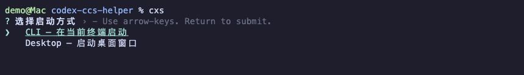
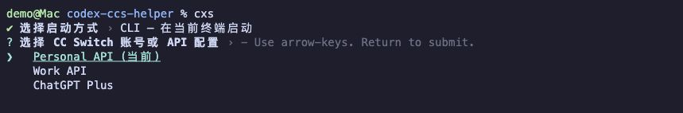
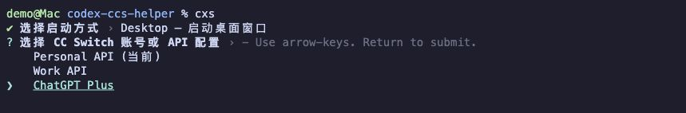
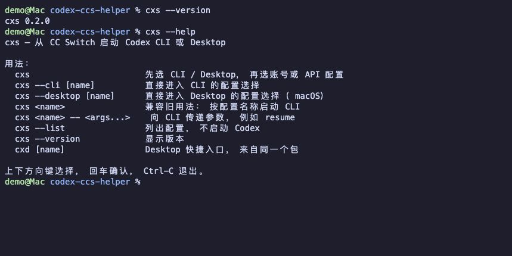

[English](README.md) | 简体中文

# Codex Helper

**支持 Codex 桌面版多开：同时打开多个桌面窗口，每个窗口使用不同的 API 配置或 ChatGPT 订阅账号。**

通过 `cxs` 从 CC Switch 选择配置，启动 Codex Desktop 或 Codex CLI。桌面窗口可以混用 API 与订阅账号，各实例复用本地项目与对话存储，并使用独立认证，运行时保持所选配置。

## 安装

需要 **Node.js 18 或以上**，以及已保存 Codex 配置的 **CC Switch**。

| 启动方式 | 还需要 |
| --- | --- |
| API → CLI | 可以在终端运行 `codex` |
| API → Desktop | macOS 和 Codex 桌面应用 |
| ChatGPT 订阅 → CLI / Desktop | macOS、Codex 桌面应用，以及在 CC Switch 中绑定了具体账号的配置 |

使用 Desktop 或订阅账号前，先正常打开一次 Codex 桌面应用，完成初始化。在 CC Switch 中添加 API 配置，或者登录 ChatGPT 并绑定账号。

```sh
npm install -g CC594697996/codex-ccs-helper
```

## 使用

在终端运行：

```sh
cxs
```

### 1. 选择 CLI 或 Desktop

上下方向键选择，回车确认，Ctrl-C 退出。



- **CLI**：在当前终端启动。先进入想要工作的项目目录，再运行 `cxs`。
- **Desktop**：打开桌面窗口，启动后在工作区列表中选择项目。

### 2. 选择账号或 API 配置

菜单读取 CC Switch 中的 Codex 配置。选中需要的条目后按回车启动。

CLI 示例：



Desktop 示例：



桌面启动完成后，终端会显示配置名称和实例信息，可以继续使用终端。

图中的配置名称为演示数据，终端画面由真实 zsh 输出在终端模拟器中重放得到。

## 同时使用多个配置

再次运行 `cxs`，选择另一条配置即可。例如，一个桌面窗口使用 ChatGPT 订阅，另一个使用 API；也可以在不同终端中分别启动不同的 API 配置。

同一条配置的桌面实例已运行时，Helper 会提示使用已有窗口。要应用 CC Switch 中修改后的配置，关闭对应实例，再重新启动。

项目文件仍位于原来的磁盘目录，本地对话文件和历史索引也会复用。**共享本地存储不保证所有窗口显示全部对话，也不保证跨供应商续聊。** 云端对话、套餐与权限属于各自账号，正在运行的对话不会自动在窗口之间同步。

## 快捷命令

| 命令 | 用途 |
| --- | --- |
| `cxs` | 选择启动方式，再选择配置 |
| `cxs --cli` | 直接选择 CLI 配置 |
| `cxs --desktop` | 直接选择 Desktop 配置 |
| `cxs --cli "Personal API"` | 按名称启动 CLI |
| `cxs --desktop "ChatGPT Plus"` | 按名称启动 Desktop |
| `cxs --cli "Personal API" -- resume` | 使用所选配置继续 CLI 对话 |
| `cxs --list` | 查看配置列表 |
| `cxs --help` | 查看帮助 |
| `cxd` | 直接选择 Desktop 配置 |

把示例名称换成 CC Switch 中显示的配置名称。Desktop 按名称启动时，名称需要唯一。CLI 参数写在 `--` 后面。



## 常见问题

**订阅账号无法启动**

在 CC Switch 中完成登录，并确认所选配置绑定到具体账号。只有名称为 “OpenAI Official” 的通用条目还不够。

**CC Switch 切换配置后，已有窗口没有变化**

每个实例固定使用启动时选择的配置。关闭对应实例，重新选择配置启动即可。

**提示数据库存在待写回的更改**

正常退出 CC Switch 后重试。

**桌面窗口没有正常打开**

确认已安装 Codex 桌面应用。启动失败时，按终端错误信息中的路径查看该实例的 `desktop.log`。

源码安装与离线安装见 [安装说明](INSTALL.zh-CN.md)，实现细节见 [技术说明](TECHNICAL.md)。

## 许可与致谢

由 [CC594697996](https://github.com/CC594697996) 维护。使用 [MIT 许可](LICENSE)。

初始交互方式参考 [luckybilly/cc-switch-helper](https://github.com/luckybilly/cc-switch-helper)。
